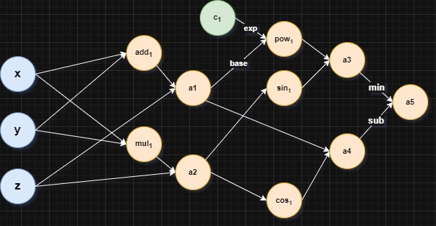

# Introduction

**Autoflow** is an automatic differentiation library built on **NumPy** as the computation engine. The engine works on the idea of a *computation graph* where every calculation is broken down into a sequence of elementary operations and storing the inputs, intermediate results and outputs as the nodes of a graph, along with some other metadata which may be necessary to impart the functionality of automatic differentiation.

# Computation Graph

This section deals with what the different aspects of the computation graph are and how they are implemented in code.
## Anatomy of a computation graph

A computation graph, CG in short, is a graphical way of representing the sequence of computations done by the programmer. Let's take an example and motivate the problem that we are solving.
```
INPUTS: x = 3, y = 5, z = 4
CALCULATIONS:
	a1 = x + y + z
	a2 = x * y * z
	a3 = a1^2 * sin(a2)
	a4 = a1 * cos(a2)
	a5 = a3 - a4

PROBLEM: find d(a5)/dx, d(a5)/dy, d(a5)/dz 
```
Now this is cakewalk for humans who have knowledge of Calculus, but how to get computers to do it efficiently, is the million dollar question. That's where CG comes in, it is a data structure single handedly responsible for revolutionalizing the field of differential programming.<br>
Just to give a preview of what is ahead, this is the computational graph that results from the above sequence of calculations.



What these different orange nodes mean is the topic in the next section, but their naming itself clarifies what they do. This is the graphical representation of the sequence of computations top to bottom in the above case.
### 1. Nodes
___
Before going ahead, define the basic units of computation (differentiable computation) that can be handled programmatically. Each variable formed by a sequence of computations is a node in the graph. But there are different types of nodes.
1. **Variable**: This is the blue type node. It contains a variable, i.e. a quantity that can vary. In physical terms, it represents any input, or a parameter to the system.
2. **Constant**: The green type nodes. It contains a constant, something that won't be changed, meaning it's gradient won't be calculated, but it is of use in calculations.
3. **Operation**: The orange type nodes. These will be formed due to the result of computation done on a bunch of nodes. There are subcategories among these too, to represent what type of computation is being done hence deciding what sort of backpropagation is to be done (will explain later).
It is assumed that all CG will have only one sink, so all the gradients that are calculated are done for one single output wrt multiple inputs and intermediate results.<br>
Every node serves three purposes:
- Store the value of the node: either input by the user for variable nodes or found by a computation in the case of an operation node.
- (For non constant nodes only) Store the gradient of output variable wrt variable represented by node (also called *local gradient*).
- (For operation nodes only): backpropagate the gradients for the operand nodes (which can be operation or variable nodes).

### 2. Operation Nodes
___
It's pretty clear now what the `Node` class must contain. The following are the bare minimum.
- `value`: the value to be stored, which can be a number, a NumPy array or any other mathematical object with a set of operations defined on it.
- `grad`: The gradient of the output variable wrt to the one represented by the node, local gradient, has the same shape as `value`.
- `operands`: Info or reference to operands that created this node, is a list or a tuple.
- `grad_fn`: Method to propagate gradient to operand nodes using the `operands` list.

Next is to define the set of operations you can do on a node. Elaborating on what that is:
An operation takes in one or more nodes, does some basic computation on them creating a new node in the process with backlinks to its operands and a sets the  `grad_fn` in the new node to propagate gradients back to it's operands. <br>
Note that every operation comes with its corresponding **backward** function, which is also set to be the `grad_fn` of the node created by that operation.

## Library Structure

`autoflow/nodes.py` contains the implementation of the nodes, and every node is a subclass of `numpy.ndarray` with the extra attributes added to it.
```python
class Node(np.ndarray):
    def __new__(
        subtype, shape, 
        dtype = float,
        buffer = None,
        offset = 0,
        strides = None,
        order = None
    ):
        newobj = np.ndarray.__new__(
            subtype, shape, dtype,
            buffer, offset, strides, order
        )

        # gradient related:
        newobj.grad = None          # local gradient at this node
        newobj.grad_fn = None       # grad fn(s) to backprop gradients
        newobj.noperands = 0        # no.of operands to create this
        newobj.operands = ()        # empty tuple
        newobj.opmethod = None      # computation operation represented by thisunit
        return newobj
```
This is the object creation routine which also initializes the `Node` subclass. All the three types of nodes are a subclass of the generic `Node` class.

**Variable**:
```python
class Variable(Node):
    
    # static member variable to count unnmaed instances
    count_unnmaed = 0

    @staticmethod
    def create_node(val, name = None):
        '''
        This method creates a variable node and returns it
        Parameters:
        ----------
        val: number | np.ndarray
            it contains data we want, will be cvt to np.ndarray
            since we wanna use that buffer memory anyways
        name: str | None
            name of the node
        '''
        if not isinstance(val, np.ndarray):
            val = np.array(val, dtype=float)
        obj = Variable(
            shape=val.shape,
            dtype=val.dtype,
            buffer=val,
            strides=val.strides
        )
        if name is not None:
            obj.name = name
        else:
            obj.name = "var_%d" %(Variable.count_unnmaed)
            Variable.count_unnmaed+=1
        
        # gradient related stuff
        obj.grad = np.zeros(obj.shape)

        return obj
```
If the programmer wants to create a variable type node then they will have to directly or indirectly call the static method `create_node`. A static variable `count_unnamed` is maintained to label the unnamed nodes.

**Constant**:
```python
class Constant(Node):

    # static counter for unnamed instances
    count_unnamed = 0

    @staticmethod
    def create_node(val, name=None):
        '''
        This method creates a variable node and returns it
        Parameters:
        ----------
        val: number | np.ndarray
            it contains data we want, will be cvt to np.ndarray
            since we wanna use that buffer memory anyways
        name: str | None
            name of the node
        '''
        if not isinstance(val, np.ndarray):
            val = np.array(val, dtype=float)
        obj = Constant(
            shape=val.shape,
            dtype=val.dtype,
            buffer=val,
            strides=val.strides
        )
        if name is not None:
            obj.name = name
        else:
            obj.name = "var_%d" %(Constant.count_unnmaed)
            Constant.count_unnmaed+=1
        
        # gradient related stuff
        obj.grad = np.zeros(obj.shape)

        return obj
```
`Constant` also works the same way.

**Operation**:
```python
class Operation(Node):

    # static dict to keep track of all the operations
    # and unnamed operation nodes
    op_dict = {}

    @staticmethod
    def create_node(
        opres: np.ndarray, opmethod:str,                
        # meant for result of operation and operation name related
        operand_a, operand_b=None, operand_c = None,    
        # operands for the operation
        name = None                                     
        # name of the node
    ):
        '''
        This method creates a variable node and returns it
        Parameters:
        ----------
        opres: number | np.ndarray
            it contains data we want, will be cvt to np.ndarray
            which is the result of the operation

        opmethod: str
            the type of operation we're doing
        
        operand_a: Node
        operand_b: Node | None
        operand_c: Node | None
            these are operands
        
        name: str|None, name of operation
        '''

        obj = Operation(
            shape=opres.shape,
            dtype=opres.dtype,
            buffer=opres,
            strides=opres.strides
        )

        operands = (operand_a, operand_b, operand_c)
        # filter out the None objects
        obj.operands = tuple(
	        operand for operand in operands if operand is not None
	    )
        obj.noperands = len(obj.operands)

        obj.opmethod = opmethod
        
        if name is not None:
            obj.name = name
        
        else:
            if opmethod not in Operation.op_dict:
                Operation.op_dict[opmethod] = 0
            
            node_id = Operation.op_dict[opmethod]
            Operation.op_dict[opmethod]+=1
            obj.name = "%s_%d" %(opmethod, node_id)
        
        # grad related
        obj.grad = np.zeros(obj.shape)

        return obj
```
Here, some extra work is needed to create an operation node, by also storing the metadata of operation done.

The question now is how is the backward pass done. But before that, how to start from variable nodes and get to an operation node.
```python
x = Variable.create_node(...)
y = Variable.create_node(...)
z = x + y
# this will return a numpy array, want it to return a node!
```
Non-overrided use of built-in methods like `__add__` and `__sub__` will result in numpy arrays, not Nodes. So, those must be overrided like so:
```python
def __add__(self, other):
	# this only does the forward computation and returns the corr. operation node
	opres = self._nodify2(method='__add__', opname='add', other=other)
	# to take care of backward computation, we need a few things
	assert opres.noperands == 2, "No.of operands to the operation don't match up!"
	# set the backward function    
	opres.grad_fn = addbackward
	return opres
```

**Subroutines**:
`_nodify2` is an operation node creation function.
```python
def _nodify2(self, method, opname:str, other=None, self_first=True):
	if not isinstance(other, Node):
		other = Constant.create_node(other)
	# get a new ndarray with the results, beeyatch!
	opres = getattr(np.ndarray, method)(self,other)

	return Operation.create_node(
		opres, opname, 
		self if self_first else other,
		other if self_first else self
	)
```
and the `grad_fn` as well finally. The `grad_fn` is a function object, which is implemented separately and has the following look.
```python
def addbackward(opnode: Operation):
    # opnode = a + b
    if not isinstance(opnode.operands[0],Constant):
	    opnode.operands[0].grad+=opnode.grad * 1
    if not isinstance(opnode.operands[1],Constant):
	    opnode.operands[1].grad+=opnode.grad * 1
```

### Backward Pass
___
It is implemented as follows:
```python
def backward(a: Node):
    topo=[]
    q = deque()
    map = set()

    a.grad = np.ones(a.shape)
    q.append(a)
    while len(q)>0:
        n = q.popleft()
        ins = n.operands
        map.add(n.name)
        for operand in ins:
            if not isinstance(operand,Operation) or operand.name in map:
                continue
            else:
                q.append(operand)
        topo.append(n)
    
    for node in topo:
        node.grad_fn(node)
```
Which is basically a BFS based topological sort from the output node and then calling the `grad_fn` of the nodes in that order.
